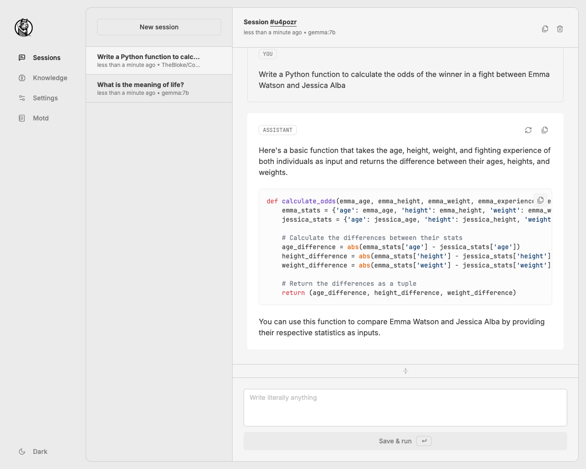
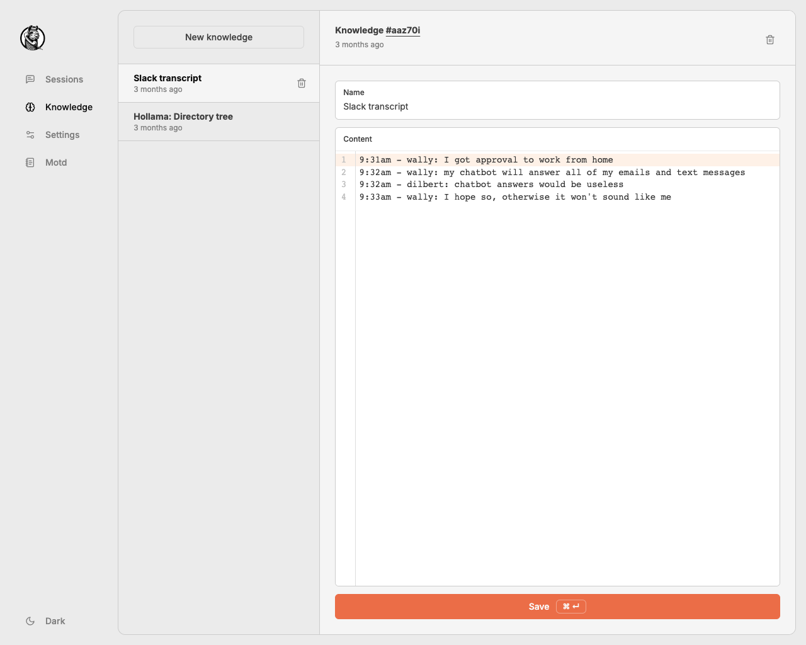

# Hollama

A minimal web-UI for talking to [Ollama](https://github.com/jmorganca/ollama/) servers.

### Features

- Large prompt fields
- Markdown rendering with syntax highlighting
- Code editor features
- Customizable system prompts
- Copy code snippets, messages or entire sessions
- Retry completions
- Stores data locally on your browser
- Responsive layout
- Light & dark themes
- Download [Ollama models](https://ollama.ai/models) directly from the UI

### Get started

- ⚡️ [Live demo](https://hollama.fernando.is)
  - _No sign-up required_
- 🖥️ Download for [macOS, Windows & Linux](https://github.com/fmaclen/hollama/releases)
- 🐳 [Self-hosting](#self-host-docker) with Docker
- 🐞 [Contribute](CONTRIBUTING.md)


|  |   |
|---|---|
|  |  |

### Self-host (Docker)

To host your own Hollama server, [install Docker](https://www.docker.com/products/docker-desktop/) and run the command below in your favorite terminal:

```shell
docker run --rm -d -p 4173:4173 ghcr.io/fmaclen/hollama:latest
```

Then visit [http://localhost:4173](http://localhost:4173).

#### Connecting to an Ollama server

If you are using the publicly hosted version or your Docker server is on a separate device than the Ollama server you'll have to set the domain in `OLLAMA_ORIGINS`. [Learn more in Ollama's docs](https://github.com/ollama/ollama/blob/main/docs/faq.md#how-do-i-configure-ollama-server).

```bash
OLLAMA_ORIGINS=https://hollama.fernando.is ollama serve
```
